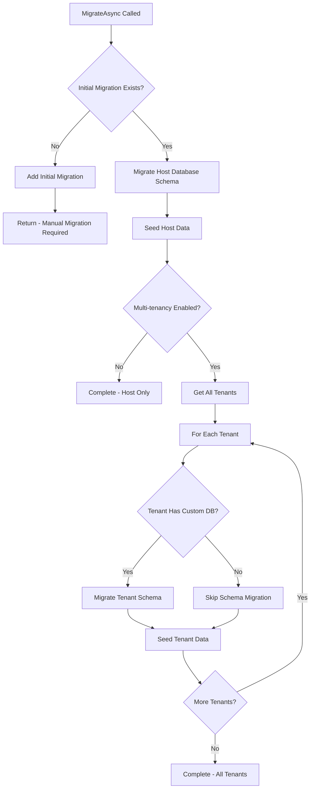

# AbpResearchWorker - Project Structure & Code Logic Documentation

**Project**: AbpResearchWorker  
**Framework**: ABP Framework (ASP.NET Core) v9.3.5  
**Created**: October 28, 2025  
**Architecture**: Layered Architecture with Domain Driven Design (DDD)

---

## 📋 Table of Contents

1. [Project Overview](#project-overview)
2. [Architecture & Layers](#architecture--layers)
3. [Key Components](#key-components)
4. [Database Migration Logic](#database-migration-logic)
5. [Multi-Tenancy Implementation](#multi-tenancy-implementation)
6. [Authentication & Authorization](#authentication--authorization)
7. [Development Guidelines](#development-guidelines)
8. [Getting Started](#getting-started)

---

## 🎯 Project Overview

AbpResearchWorker is built on the **ABP Framework v9.3.5**, following enterprise-grade patterns and practices. The project implements a complete multi-tenant SaaS application with:

- **Multi-layered Architecture** (Domain, Application, API, Infrastructure)
- **Multi-tenancy Support** (Database per tenant or shared database)
- **Identity & Permission Management**
- **Books Management System** (CRUD operations with authorization)
- **Internationalization** (21+ languages supported)
- **RESTful APIs** with OpenAPI/Swagger documentation
- **Angular 20.0 Frontend** (separate SPA application)

---

## 🏗️ Architecture & Layers

### Layer Dependencies (Bottom-Up)
```
┌─────────────────────────────────────┐
│         Presentation Layer          │
│    (HttpApi.Host + Angular App)     │
├─────────────────────────────────────┤
│        Application Layer            │
│  (Application + Application.Contracts) │
├─────────────────────────────────────┤
│          Domain Layer               │
│    (Domain + Domain.Shared)         │
├─────────────────────────────────────┤
│       Infrastructure Layer          │
│      (EntityFrameworkCore)          │
└─────────────────────────────────────┘
```

### 1. **Domain.Shared Layer** (`AbpResearchWorker.Domain.Shared`)
**Purpose**: Contains constants, enums, and shared configurations used across all layers.

**Key Files**:
- `AbpResearchWorkerDomainSharedModule.cs` - Module configuration
- `Books/BookType.cs` - Book type enumeration
- `Localization/AbpResearchWorkerResource.cs` - Localization resources
- `AbpResearchWorkerModuleExtensionConfigurator.cs` - Module extensions

**Features**:
- ✅ Multi-language support (21 languages)
- ✅ Multi-tenancy enablement
- ✅ Global feature configuration

### 2. **Domain Layer** (`AbpResearchWorker.Domain`)
**Purpose**: Core business logic, domain entities, repository interfaces, and domain services.

**Key Files**:
- `AbpResearchWorkerDomainModule.cs` - Domain module configuration
- `Books/Book.cs` - **Book entity with audit properties**
- `Data/AbpResearchWorkerDbMigrationService.cs` - **Database migration orchestrator**
- `OpenIddict/OpenIddictDataSeedContributor.cs` - OAuth client configuration

**Current Logic**:
- Book entity with Name, Type, PublishDate, Price properties
- Email sender configuration (NullEmailSender in DEBUG mode)
- Multi-tenancy option configuration
- Database migration and seeding coordination
- OpenIddict OAuth 2.0 client setup

### 3. **Application Layer** (`AbpResearchWorker.Application`)
**Purpose**: Application services implementing business use cases and coordinating domain objects.

**Key Files**:
- `AbpResearchWorkerApplicationModule.cs` - Application module with AutoMapper
- `AbpResearchWorkerAppService.cs` - Main application service
- `Books/BookAppService.cs` - **Complete CRUD service for Books**
- `AbpResearchWorkerApplicationAutoMapperProfile.cs` - Entity-DTO mappings

**Current Implementation**:
- Full Books CRUD operations with authorization
- Paged and sorted list queries
- AutoMapper configuration for Book entity

### 4. **Infrastructure Layer** (`AbpResearchWorker.EntityFrameworkCore`)
**Purpose**: Data access implementation using Entity Framework Core.

**Key Files**:
- `EntityFrameworkCore/AbpResearchWorkerDbContext.cs` - Main database context
- `EntityFrameworkCore/AbpResearchWorkerEntityFrameworkCoreModule.cs` - EF Core module
- `EntityFrameworkCore/AbpResearchWorkerDbContextFactory.cs` - Design-time factory
- `EntityFrameworkCore/EntityFrameworkCoreAbpResearchWorkerDbSchemaMigrator.cs` - Schema migrator

**Database Configuration**:
- Implements: `IIdentityDbContext`, `ITenantManagementDbContext`
- Books DbSet with proper entity configuration
- SQL Server provider configured
- Configured modules: Identity, Permissions, Settings, Audit Logging, Feature Management

### 5. **Presentation Layer** (`AbpResearchWorker.HttpApi.Host`)
**Purpose**: RESTful API endpoints, authentication, and web hosting.

**Key Features**:
- OpenIddict authentication/authorization (HTTPS: 44350)
- Swagger API documentation with client integration
- CORS configuration for Angular frontend (port 4200)
- LeptonX Lite theme integration
- Multi-tenancy middleware
- Health checks endpoint (`/health-status`)
- Custom branding provider

### 6. **Frontend Layer** (`angular/`)
**Purpose**: Angular 20.0 SPA application with ABP integration.

**Key Features**:
- ABP Angular packages v9.3.5
- LeptonX theme integration
- Books management UI component
- OAuth authentication integration
- Multi-language support

---

## 🔑 Key Components

### ABP Modules Integrated
```csharp
// Pre-installed ABP modules
├── AbpIdentityDomainModule          // User & Role management
├── AbpTenantManagementDomainModule  // Multi-tenancy
├── AbpPermissionManagementModule    // Authorization
├── AbpSettingManagementModule       // Application settings
├── AbpAuditLoggingModule           // Audit trails
├── AbpBackgroundJobsModule         // Background processing
├── AbpFeatureManagementModule      // Feature toggles
├── AbpOpenIddictModule             // OAuth 2.0/OpenID Connect
└── BlobStoringDatabaseModule       // File storage
```

### Database Entities (Configured)
```csharp
// Business Entities
public DbSet<Book> Books { get; set; }

// Identity Management (Inherited from ABP)
public DbSet<IdentityUser> Users { get; set; }
public DbSet<IdentityRole> Roles { get; set; }
public DbSet<IdentityClaimType> ClaimTypes { get; set; }
public DbSet<OrganizationUnit> OrganizationUnits { get; set; }

// Tenant Management (Inherited from ABP)
public DbSet<Tenant> Tenants { get; set; }
public DbSet<TenantConnectionString> TenantConnectionStrings { get; set; }

// Book Entity Definition
public class Book : AuditedAggregateRoot<Guid>
{
    public string Name { get; set; }
    public BookType Type { get; set; }
    public DateTime PublishDate { get; set; }
    public float Price { get; set; }
}
```

---

## 🔄 Database Migration Logic

### Migration Service Workflow (`AbpResearchWorkerDbMigrationService.cs`)



### Key Migration Methods

#### `MigrateAsync()`
**Main orchestration method**:
1. Checks for initial migration existence
2. Migrates host database schema
3. Seeds host data (admin user, default settings)
4. Iterates through tenants (if multi-tenancy enabled)
5. Migrates tenant databases and seeds tenant-specific data

#### `AddInitialMigrationIfNotExist()`
**Auto-migration creation**:
- Detects if EntityFrameworkCore project exists
- Checks for existing migrations folder
- Automatically runs ABP CLI command: `abp create-migration-and-run-migrator`

#### `MigrateDatabaseSchemaAsync()`
**Schema migration execution**:
- Uses injected `IAbpResearchWorkerDbSchemaMigrator` instances
- Supports multiple database providers (SQL Server configured)
- Handles both host and tenant databases

#### `SeedDataAsync()`
**Data seeding with default values**:
```csharp
await _dataSeeder.SeedAsync(new DataSeedContext(tenant?.Id)
    .WithProperty(IdentityDataSeedContributor.AdminEmailPropertyName, 
        AbpResearchWorkerConsts.AdminEmailDefaultValue)
    .WithProperty(IdentityDataSeedContributor.AdminPasswordPropertyName, 
        AbpResearchWorkerConsts.AdminPasswordDefaultValue)
);
```

---

## 🏢 Multi-Tenancy Implementation

### Configuration
```csharp
// MultiTenancyConsts.cs
public const bool IsEnabled = true; // ✅ Multi-tenancy ENABLED
```

### Tenancy Strategies Supported
1. **Database Per Tenant**: Each tenant has separate database
2. **Shared Database**: All tenants share same database with tenant filtering
3. **Hybrid**: Mix of both strategies

### Migration Handling
- **Host Database**: Always migrated first
- **Tenant Databases**: Migrated only if custom connection strings exist
- **Schema Deduplication**: Same connection strings are migrated only once
- **Tenant Isolation**: Each tenant's context is properly isolated during migration

---

## 🔐 Authentication & Authorization

### OpenIddict Integration
```csharp
// Authentication flow
├── OAuth 2.0 / OpenID Connect
├── JWT Token-based authentication  
├── Authorization Code flow support
├── Development certificates (auto-generated)
└── Production certificate support (.pfx files)
```

### Security Features
- **Dynamic Claims**: `AbpClaimsPrincipalFactoryOptions`
- **HTTPS Enforcement**: Configurable via `AuthServer:RequireHttpsMetadata`
- **CORS Policy**: Configurable allowed origins
- **Security Headers**: Applied via ABP security middleware

---

## 📝 Development Guidelines

### Adding New Entities
1. **Domain Layer**: Create entity classes inheriting from ABP base classes
2. **EntityFrameworkCore**: Add DbSet properties to `AbpResearchWorkerDbContext`
3. **Application Layer**: Create application services and DTOs (see `BookAppService` example)
4. **HttpApi**: Add controller endpoints
5. **Angular**: Create UI components (see `book` component example)

### Creating Migrations
```powershell
# Manual migration creation
dotnet ef migrations add YourMigrationName -p src\AbpResearchWorker.EntityFrameworkCore

# Or use ABP CLI (recommended)
abp create-migration-and-run-migrator "src\AbpResearchWorker.EntityFrameworkCore"

# Run database migrator
cd src\AbpResearchWorker.DbMigrator
dotnet run
```

### Multi-Tenancy Considerations
- Always use `ICurrentTenant.Change(tenantId)` when working with tenant-specific data
- Repository methods automatically filter by current tenant
- Database connections are resolved per tenant context

### Localization
- Add new resource keys to `/Localization/AbpResearchWorker/en.json`
- Use `IStringLocalizer<AbpResearchWorkerResource>` for translations
- 21 languages pre-configured and ready for translation

---

## 🚀 Getting Started

### Prerequisites
- **.NET 9.0 SDK**
- **Node.js 20.19+, 22.12+, or 24+** (for Angular 20.0 frontend) 
  - *Note: v23.x works with warnings*
- **SQL Server** (configured for VNNOT02022 server)
- **ABP CLI**: `dotnet tool install -g Volo.Abp.Cli`
- **PowerShell Execution Policy**: Set to RemoteSigned for npm scripts

### Initial Setup
1. **Install ABP CLI** (if not already installed):
   ```powershell
   dotnet tool install -g Volo.Abp.Cli
   ```
2. **Set PowerShell Execution Policy**:
   ```powershell
   Set-ExecutionPolicy -ExecutionPolicy RemoteSigned -Scope CurrentUser
   ```
3. **Configure Connection String**: Update `appsettings.json` in HttpApi.Host
   - Current: `Server=VNNOT02022;Database=AbpResearchWorker;Trusted_Connection=True;TrustServerCertificate=true`
4. **Install Client Packages**: 
   ```powershell
   # From project root
   abp install-libs
   
   # Or manually for Angular (if Node.js version issues):
   cd angular
   npm install --legacy-peer-deps
   ```
3. **Run Database Migration**: 
   ```powershell
   cd src\AbpResearchWorker.DbMigrator
   dotnet run
   ```
4. **Start Backend API**:
   ```powershell
   cd src\AbpResearchWorker.HttpApi.Host  
   dotnet run
   ```
   - API URL: `https://localhost:44350`
5. **Start Angular Frontend**:
   ```powershell
   cd angular
   npm install
   npm start
   ```
   - Frontend URL: `http://localhost:4200`

### Default Credentials
- **Username**: `admin`
- **Password**: `1q2w3E*` (configurable in constants)

---

## 📚 Additional Resources

- **ABP Framework Documentation**: https://docs.abp.io
- **ABP Community**: https://community.abp.io
- **Entity Framework Core**: https://docs.microsoft.com/ef/core
- **OpenIddict**: https://documentation.openiddict.com

---

**Last Updated**: October 28, 2025  
**Maintainer**: Development Team  
**Version**: 1.0.0  
**ABP Version**: 9.3.5  
**Angular Version**: 20.0.0