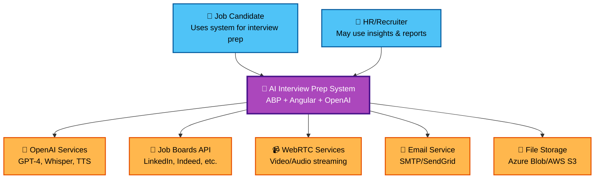
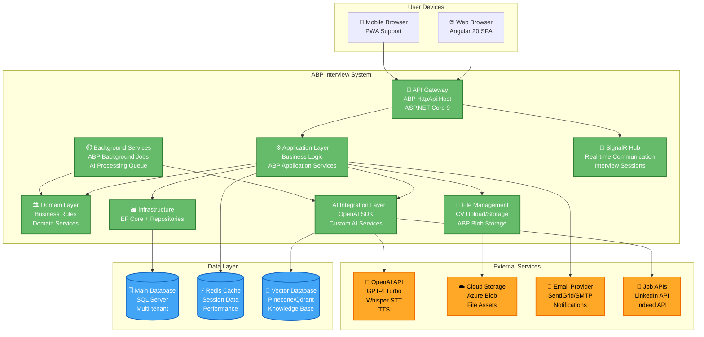
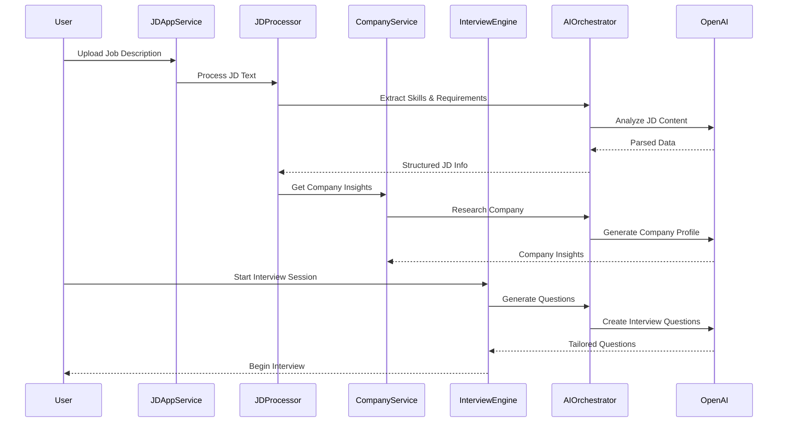
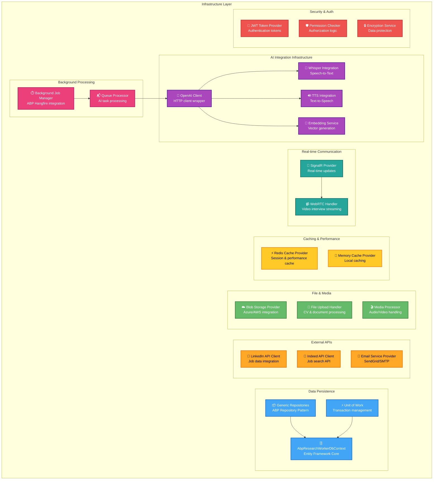
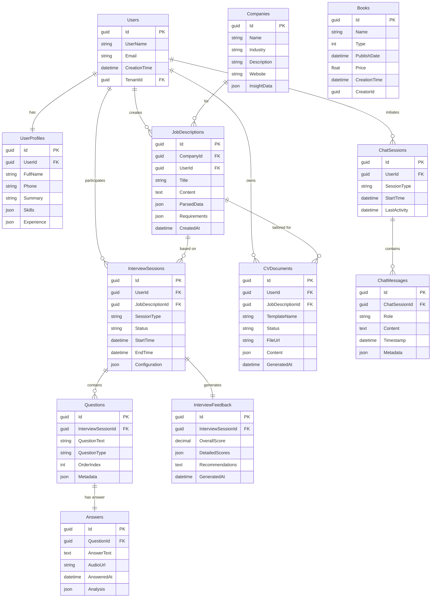
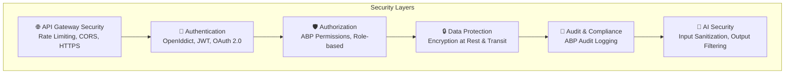

# 🏗️ Step 3 — System Architecture Design (C4 Model)

Define **how** the AI Interview Preparation System is structured using the C4 model.

---

## 🎯 Goal
Map the functional design into concrete system architecture before API design and implementation.

---

## 📐 C4 Model Overview

The C4 model provides four levels of architectural abstraction:
- **C1**: System Context - High-level view of the system and its users
- **C2**: Container - Major technical building blocks  
- **C3**: Component - Internal structure of containers
- **C4**: Code - Class-level interactions (optional)

---

## 🌐 C1: System Context Diagram



### System Context Description
- **Primary Users**: Job candidates preparing for interviews
- **Secondary Users**: HR/Recruiters accessing analytics
- **Core System**: ABP-based interview preparation platform
- **External Dependencies**: AI services, job data, real-time communication

---

## 🏢 C2: Container Diagram



### Container Responsibilities

| Container | Technology | Purpose |
|-----------|------------|---------|
| **Angular SPA** | Angular 20, ABP NG | User interface, real-time UI updates |
| **API Gateway** | ASP.NET Core, ABP HttpApi | REST endpoints, authentication, CORS |
| **Application Layer** | ABP Application Services | Business use cases, orchestration |
| **Domain Layer** | .NET 9, ABP Domain | Core business logic, entities, rules |
| **Infrastructure** | EF Core, ABP Repositories | Data persistence, external integrations |
| **AI Integration** | OpenAI SDK, Custom Services | AI processing, GPT interactions |
| **Background Jobs** | ABP Background Jobs | Async processing, AI tasks |
| **SignalR Hub** | ASP.NET SignalR | Real-time interview sessions |
| **File Manager** | ABP Blob Storage | CV upload, file management |

---

## 🧩 C3: Component Diagram - Application Layer

```mermaid
graph TB
    subgraph "ABP Application Layer Components"
        
        subgraph "User Management"
            UserAppService[👤 UserAppService<br/>Profile management]
            AuthService[🔐 AuthService<br/>JWT & OAuth]
        end
        
        subgraph "Job Description Module"
            JDProcessor[📋 JDProcessorService<br/>Parse & analyze JDs]
            JDAppService[📋 JDAppService<br/>JD CRUD operations]
        end
        
        subgraph "Company Intelligence"
            CompanyService[🏢 CompanyInsightService<br/>Company research & analysis]
            CompanyAppService[🏢 CompanyAppService<br/>Company data management]
        end
        
        subgraph "CV Builder Module"
            CVGenerator[📄 CVGeneratorService<br/>AI-powered CV creation]
            CVAppService[📄 CVAppService<br/>CV management & export]
        end
        
        subgraph "Interview Simulation"
            InterviewEngine[🎭 InterviewEngineService<br/>Conduct AI interviews]
            InterviewAppService[🎭 InterviewAppService<br/>Session management]
            FeedbackService[📊 FeedbackService<br/>Performance analysis]
        end
        
        subgraph "Chat Assistant"
            ChatService[💬 ChatAssistantService<br/>AI-powered guidance]
            ChatAppService[💬 ChatAppService<br/>Chat session management]
        end
        
        subgraph "Analytics & Reports"
            AnalyticsService[📈 AnalyticsService<br/>Performance tracking]
            ReportService[📋 ReportService<br/>Generate insights]
        end
        
        subgraph "Legacy (Current)"
            BookService[📚 BookAppService<br/>Current implementation<br/>To be replaced/extended]
        end
    end
    
    subgraph "Cross-Cutting Services"
        AIOrchestrator[🤖 AIOrchestrationService<br/>Coordinate AI operations]
        NotificationService[🔔 NotificationService<br/>Email/Push notifications]
        AuditService[📝 AuditService<br/>Activity logging]
    end
    
    subgraph "External Integration"
        OpenAIConnector[🤖 OpenAIConnector<br/>GPT, Whisper, TTS APIs]
        JobBoardConnector[💼 JobBoardConnector<br/>External job data]
        FileStorageConnector[📁 FileStorageConnector<br/>Cloud file operations]
    end
    
    %% Dependencies
    JDProcessor --> AIOrchestrator
    CompanyService --> AIOrchestrator
    CVGenerator --> AIOrchestrator
    InterviewEngine --> AIOrchestrator
    ChatService --> AIOrchestrator
    
    AIOrchestrator --> OpenAIConnector
    CompanyService --> JobBoardConnector
    CVAppService --> FileStorageConnector
    
    InterviewAppService --> NotificationService
    UserAppService --> AuditService
    
    classDef moduleStyle fill:#66bb6a,stroke:#2e7d32,stroke-width:2px,color:#fff
    classDef crossCuttingStyle fill:#ffca28,stroke:#f57f17,stroke-width:2px,color:#000
    classDef externalStyle fill:#ef5350,stroke:#c62828,stroke-width:2px,color:#fff
    classDef legacyStyle fill:#9e9e9e,stroke:#424242,stroke-width:2px,color:#fff
    
    class UserAppService,AuthService,JDProcessor,JDAppService,CompanyService,CompanyAppService,CVGenerator,CVAppService,InterviewEngine,InterviewAppService,FeedbackService,ChatService,ChatAppService,AnalyticsService,ReportService moduleStyle
    class AIOrchestrator,NotificationService,AuditService crossCuttingStyle
    class OpenAIConnector,JobBoardConnector,FileStorageConnector externalStyle
    class BookService legacyStyle
```



### Component Interactions

#### Core Workflow Example: JD to Interview Flow


---

## 🗄️ C3: Component Diagram - Domain Layer

```mermaid
graph TB
    subgraph "Domain Entities (Aggregates)"
        
        subgraph "User Context"
            User[👤 User<br/>Identity + Profile]
            UserProfile[👤 UserProfile<br/>Skills, Experience]
        end
        
        subgraph "Job Context"
            JobDescription[📋 JobDescription<br/>JD content & analysis]
            Company[🏢 Company<br/>Company information]
            JobRequirement[📋 JobRequirement<br/>Skills & qualifications]
        end
        
        subgraph "CV Context"
            CVDocument[📄 CVDocument<br/>Generated CVs]
            CVTemplate[📄 CVTemplate<br/>CV layouts & styles]
            CVSection[📄 CVSection<br/>CV content sections]
        end
        
        subgraph "Interview Context"
            InterviewSession[🎭 InterviewSession<br/>Interview data & state]
            Question[❓ Question<br/>Interview questions]
            Answer[💬 Answer<br/>User responses]
            Feedback[📊 Feedback<br/>Performance analysis]
        end
        
        subgraph "Chat Context"
            ChatSession[💬 ChatSession<br/>Assistant conversations]
            ChatMessage[💬 ChatMessage<br/>Individual messages]
        end
        
        subgraph "Legacy Context"
            Book[📚 Book<br/>Current entity<br/>To be evolved]
        end
    end
    
    subgraph "Domain Services"
        InterviewDomainService[🎭 InterviewDomainService<br/>Interview business rules]
        CVGenerationDomainService[📄 CVGenerationDomainService<br/>CV creation logic]
        CompanyResearchDomainService[🏢 CompanyResearchDomainService<br/>Company analysis logic]
        ScoringDomainService[📊 ScoringDomainService<br/>Performance calculation]
    end
    
    subgraph "Value Objects"
        Score[📊 Score<br/>Interview performance]
        Skill[🔧 Skill<br/>Technical/soft skills]
        ContactInfo[📧 ContactInfo<br/>User contact details]
        DateRange[📅 DateRange<br/>Experience periods]
    end
    
    subgraph "Domain Events"
        InterviewCompleted[📢 InterviewCompletedEvent]
        CVGenerated[📢 CVGeneratedEvent]
        JDAnalyzed[📢 JDAnalyzedEvent]
        FeedbackGenerated[📢 FeedbackGeneratedEvent]
    end
    
    %% Relationships
    User --> UserProfile
    JobDescription --> Company
    JobDescription --> JobRequirement
    InterviewSession --> Question
    InterviewSession --> Answer
    InterviewSession --> User
    Answer --> Feedback
    CVDocument --> User
    CVDocument --> CVSection
    ChatSession --> User
    ChatSession --> ChatMessage
    
    InterviewSession --> InterviewDomainService
    CVDocument --> CVGenerationDomainService
    Company --> CompanyResearchDomainService
    Feedback --> ScoringDomainService
    
    InterviewSession -.-> InterviewCompleted
    CVDocument -.-> CVGenerated
    JobDescription -.-> JDAnalyzed
    Feedback -.-> FeedbackGenerated
    
    classDef entityStyle fill:#66bb6a,stroke:#2e7d32,stroke-width:2px,color:#fff
    classDef serviceStyle fill:#ffca28,stroke:#f57f17,stroke-width:2px,color:#000
    classDef valueStyle fill:#42a5f5,stroke:#1565c0,stroke-width:2px,color:#fff
    classDef eventStyle fill:#ef5350,stroke:#c62828,stroke-width:2px,color:#fff
    classDef legacyStyle fill:#9e9e9e,stroke:#424242,stroke-width:2px,color:#fff
    
    class User,UserProfile,JobDescription,Company,JobRequirement,CVDocument,CVTemplate,CVSection,InterviewSession,Question,Answer,Feedback,ChatSession,ChatMessage entityStyle
    class InterviewDomainService,CVGenerationDomainService,CompanyResearchDomainService,ScoringDomainService serviceStyle
    class Score,Skill,ContactInfo,DateRange valueStyle
    class InterviewCompleted,CVGenerated,JDAnalyzed,FeedbackGenerated eventStyle
    class Book legacyStyle
```



---

## 🔌 C3: Component Diagram - Infrastructure Layer



---

## 📊 Data Architecture

### Database Schema Design



---

## 🔄 Migration Strategy from Books to Interview System

### Phase 1: Extend Current System
```csharp
// Keep existing Book system as reference
public class Book : AuditedAggregateRoot<Guid>
{
    // Current implementation remains
}

// Add new entities alongside
public class JobDescription : AuditedAggregateRoot<Guid>
{
    public string Title { get; set; }
    public string Content { get; set; }
    // New AI-powered functionality
}
```

### Phase 2: Gradual Replacement
- Implement new modules (JD, Company, Interview)
- Maintain Books as a reference implementation
- Migrate UI components progressively

### Phase 3: Complete Transformation
- Remove or repurpose Books system
- Full AI interview system operational

---

## 🛡️ Security Architecture



---

## 📈 Scalability Considerations

### Horizontal Scaling Points
1. **API Layer**: Load-balanced ABP HttpApi.Host instances
2. **Background Jobs**: Distributed job processing with Redis
3. **AI Services**: Queue-based AI request processing
4. **Database**: Read replicas for analytics queries
5. **File Storage**: CDN for CV and media files

### Performance Optimizations
1. **Caching Strategy**: Redis for session data, Memory cache for static data
2. **Database Indexing**: Optimized queries for interview search
3. **AI Response Caching**: Cache common AI responses
4. **CDN Integration**: Fast file delivery

---

## ✅ Implementation Priorities

### Priority 1 (Foundation)
- [ ] Complete Domain Models for Interview entities
- [ ] Implement AI Integration Infrastructure
- [ ] Set up Background Job Processing

### Priority 2 (Core Features)
- [ ] Job Description Processing Service
- [ ] Company Intelligence Service
- [ ] Basic Interview Engine

### Priority 3 (Advanced Features)
- [ ] Real-time Interview Sessions (WebRTC)
- [ ] Advanced CV Generation
- [ ] Analytics Dashboard

---

## 🔄 Next Steps

1. **Complete this Architecture Document** ✅
2. **Design API Specifications** (Step 4)
3. **Implement Core Domain Models**
4. **Set up AI Integration Layer**
5. **Begin Interview Engine Development**

---

**Architecture Version**: 1.0  
**Last Updated**: October 31, 2025  
**Next Review**: After API design completion